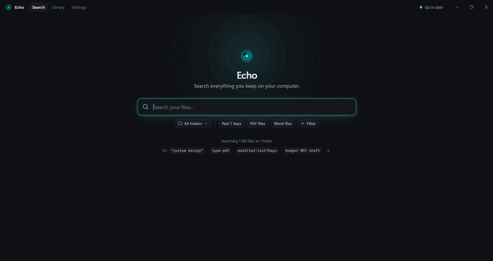
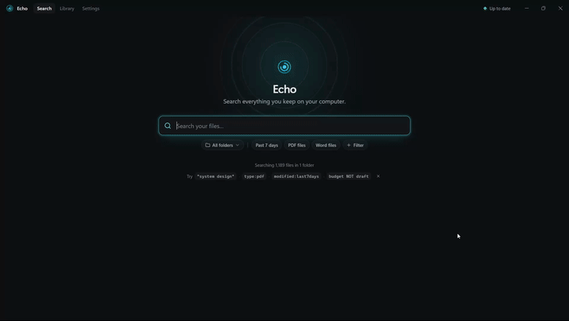
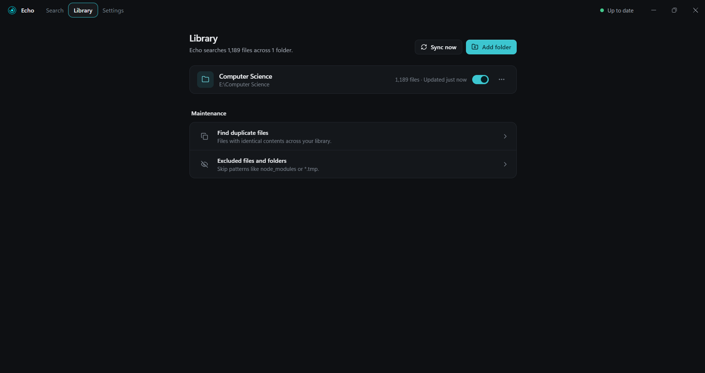
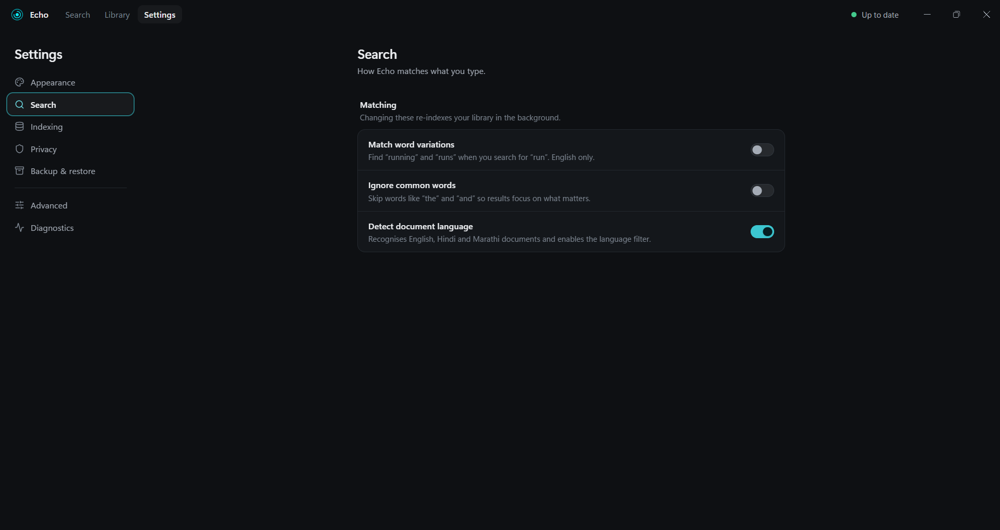

# Echo

**A fast, local search engine for everything on your computer.**

Echo indexes the documents in folders you choose (PDFs, Word files, notes, web pages, plain text) and lets you search their *contents*, not just their names. You type what you remember and Echo finds the file, shows the matching passage, and opens it in one keystroke.





---

## Why Echo?

The more documents, projects, PDFs and notes you have, the harder it gets to find anything. File browsers make you remember **where** something was stored, **what** it was called, and **which folder** it ended up in.

Echo treats this as a search-engine problem rather than a file-browser problem. It builds a real index of your files so you can search by content, and it keeps the experience as simple as a single search box.

## The idea

Echo was inspired by how modern search engines feel: you describe what you remember, and the system finds the relevant information. The guiding principle:

> **Hide search-engine complexity behind a simple desktop experience.**

The goal was never "Ctrl+F for files." Echo implements its own search stack, including a positional **inverted index**, **BM25 ranking**, **phrase** and **boolean** queries, metadata **filters**, **prefix and fuzzy** term expansion, **highlighted snippets**, and **incremental updates**. All of it sits behind one input field.

---

## Features

### Search
- **Full-text search** over a positional inverted index stored in SQLite
- **Boolean queries:** `AND`, `OR`, `NOT`, parentheses, and implicit AND between words
- **Exact phrases** with `"quotes"`, matched by term position
- **Filters** for type, folder, dates, size, author and language
- **Folder scope:** limit a search to selected library folders
- **Term expansion:** stemming (English), prefix matching, and fuzzy matching (edit distance 1) as a fallback, each weighted below an exact match
- **Multi-signal ranking:** BM25 combined with phrase, filename, folder and recency signals
- **Highlighted snippets** and **autocomplete** for terms and filter keys, backed by a trie
- Clear error messages for malformed queries or unknown filters, so a typo never silently matches everything

### Indexing
- **Background indexing** with live progress and cancellation
- **Incremental change detection** that checks the cheapest signal first: size + mtime, then a SHA-256 content hash, then re-extraction
- **File watching** (chokidar) with debounced updates as files change
- **Indexing modes:** immediate, on startup, scheduled (hourly/daily), or manual
- **Ignore rules** (glob patterns via minimatch) with sensible defaults such as `node_modules/` and `.git/`
- **Failure tracking:** see files that failed to index, then retry or ignore them
- **Language detection** (English, Hindi, Marathi), with stemming only where a stemmer exists



### Product
- Native-feeling desktop app with **light, dark and system** themes
- **Keyboard-first** navigation (see below)
- **Library** management: add, remove, enable or disable folders
- **Duplicate detection** based on content hashes
- **Diagnostics:** index statistics, integrity verification and repair, log access
- **Backup and restore** of the index and settings



---

## Search syntax

```text
database                     # single term (stemmed, prefix-expanded)
database sqlite              # implicit AND
database AND sqlite
database OR sqlite
NOT database
(sqlite OR postgres) AND index
"local search"               # exact phrase

type:pdf
type:pdf AND database
folder:projects
modified:last7days
after:2025-01 before:2025-06
size>5mb
author:smith
lang:hindi
```

| Filter | Operators | Example values |
|---|---|---|
| `type` / `ext` | `:` | `pdf`, `docx`, `md` |
| `folder` | `:` | path fragment |
| `modified`, `created` | `:` `<` `>` `<=` `>=` | `2025`, `2025-03`, `2025-03-14`, `today`, `yesterday`, `last30days` |
| `before`, `after` | `:` | same date forms |
| `size` | `:` `<` `>` `<=` `>=` | `500kb`, `5mb` |
| `author` | `:` | substring |
| `language` / `lang` | `:` | `eng`, `hin`, `mar` |

## Keyboard shortcuts

| Keys | Action |
|---|---|
| `Ctrl/⌘ K` or `Ctrl/⌘ F` | Focus search |
| `Ctrl/⌘ 1` / `2` / `3` (or `,`) | Search / Library / Settings |
| `↑` `↓` `PgUp` `PgDn` | Move through results |
| `Enter` | Open file |
| `Ctrl/⌘ Enter` or `Shift Enter` | Reveal in folder |
| `Ctrl/⌘ C` | Copy selected result's path |
| `Esc` | Clear query, then filters |

---

## Supported formats

| Format | Extensions | Extraction |
|---|---|---|
| Plain text | `.txt` | native |
| Markdown | `.md` | native |
| PDF | `.pdf` | `pdf-parse` |
| Word | `.docx` | `mammoth` |
| HTML | `.html`, `.htm` | `cheerio` |

Extractors share a single interface and register by extension, so a new format only requires one new module.

---

## Architecture

```text
src/
  electron/         Main process, IPC handlers, preload bridge
  indexer/          Crawler, sync, queue, watcher, hashing, tokenizer
  file-extractors/  One extractor per format and a registry
  language/         Normalization, stop words, stemming, language detection
  search/           Query parser → filters → term expansion → ranking → snippets
  database/         SQLite schema and repositories (better-sqlite3)
  services/         Backup, migration, recovery, integrity, locking, scheduling, logging
  renderer/         React UI (pages, components, Zustand stores)
```

**Indexing:** crawl → diff against stored file state → queue changed files → extract → tokenize → write terms and postings in a transaction.
**Search:** parse into an AST → compile and validate filters → expand terms → evaluate boolean and phrase logic over postings → rank → generate snippets for the top results.

Indexing and search run in the Electron main process against a local SQLite database. There is no server or cloud component.

## Tech stack

Electron · React 18 · TypeScript · Vite · Tailwind CSS 4 · Zustand · SQLite (better-sqlite3) · chokidar · Vitest · Playwright · electron-builder

---

## Getting started

```bash
npm install          # also rebuilds native modules for Electron
npm run dev          # Vite + Electron in development mode
```

### Tests

```bash
npm run test:unit    # Vitest (parser, BM25, phrase/fuzzy search, indexing pipeline, services)
npm run test:e2e     # Playwright driving the Electron app
```

`test:unit` rebuilds `better-sqlite3` for Node, runs the suite, then restores the Electron build.

### Packaging

```bash
npm run dist:win     # portable .exe + .msi (x64)
npm run dist:mac     # .dmg (arm64)
npm run dist:linux   # AppImage (x64)
```
